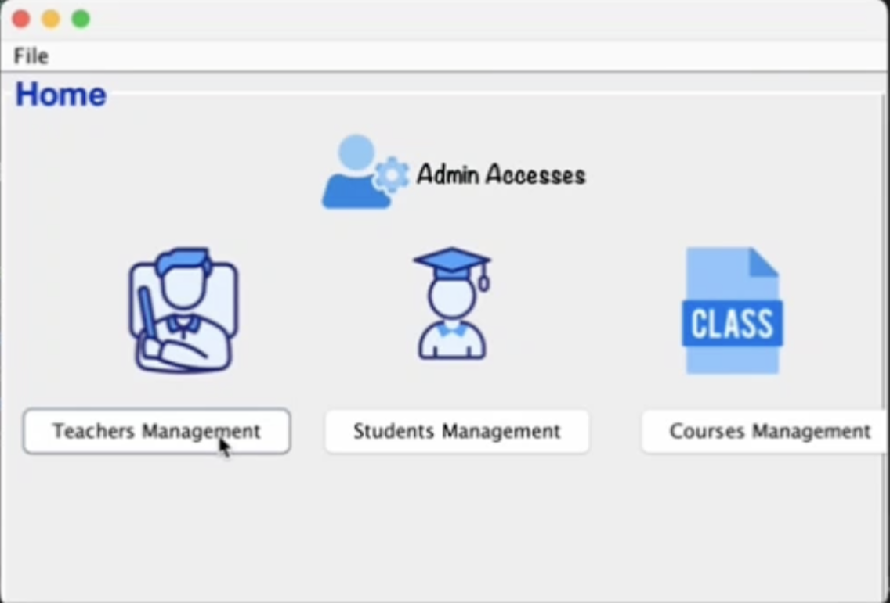
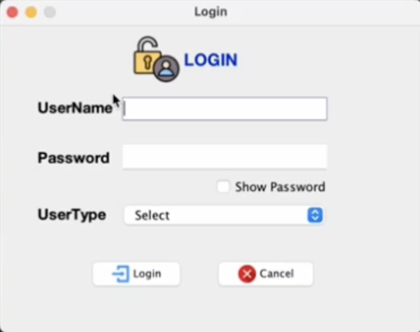

# University Management System

This project is a comprehensive University Management System with a Command Line Interface (CLI) for the admin and teacher panel using Java Swing, and a Student Management System built in Flutter with a PHP backend and MySQL database.

## Table of Contents
- [Features](#features)
- [Installation](#installation)
  - [Backend (PHP)](#backend-php)
  - [Admin & Teacher Panel (Java Swing)](#admin--teacher-panel-java-swing)
  - [Student Management System (Flutter)](#student-management-system-flutter)
- [Usage](#usage)
- [Demo](#demo)
- [Screenshots](#screenshots)
- [Contributing](#contributing)
- [License](#license)

## Features

- **Admin Panel**: Manage students, teachers, courses, and more.
- **Teacher Panel**: Manage course content, student grades, etc.
- **Student Management**: Students can view courses, grades, and manage their profile.
- **Authentication**: Secure login for admins, teachers, and students.
- **Database**: MySQL for storing all the university data.
- **Responsive Design**: Student management system designed in Flutter for mobile responsiveness.

## Installation

### Backend (PHP)

1. Clone the repository:
    ```bash
    git clone https://github.com/MohadeseSaffari/Flutter-Project.git
    ```

2. Navigate to the backend directory:
    ```bash
    cd university-management-system/backend
    ```

3. Set up your PHP environment and install dependencies (you can use tools like XAMPP, WAMP, etc.).

4. Import the database:
    - Open `phpMyAdmin`.
    - Create a new database.
    - Import the SQL file located in the `database` folder.

5. Configure the database connection:
    - Edit the `config.php` file with your database details.

6. Start the PHP server:
    ```bash
    php -S localhost:8000
    ```

### Admin & Teacher Panel (Java Swing)

1. Ensure you have Java Development Kit (JDK) installed.

2. Open the project in your preferred IDE (such as IntelliJ IDEA, Eclipse, or NetBeans).

3. Navigate to the `admin-teacher-panel` directory.

4. Build and run the project from your IDE.

### Student Management System (Flutter)

1. Ensure you have Flutter installed. You can follow the instructions from the [official Flutter website](https://flutter.dev/docs/get-started/install).

2. Navigate to the `student-management-system` directory:
    ```bash
    cd university-management-system/student-management-system
    ```

3. Get the Flutter dependencies:
    ```bash
    flutter pub get
    ```

4. Run the Flutter application:
    ```bash
    flutter run
    ```

## Usage

- **Admin Panel**: Access via the CLI to manage university data.
- **Teacher Panel**: Access via the CLI to manage course and student data.
- **Student Management System**: Use the Flutter app to view and manage student information.

## Demo

[

Click the image above to watch the demo video.

## Screenshots

### Admin Panel


### Login of Cli


### Flutter App HomePage


## Contributing

Contributions are welcome! Please fork this repository and submit pull requests.

1. Fork the repository.
2. Create your feature branch:
    ```bash
    git checkout -b feature/YourFeature
    ```
3. Commit your changes:
    ```bash
    git commit -m 'Add some feature'
    ```
4. Push to the branch:
    ```bash
    git push origin feature/YourFeature
    ```
5. Open a pull request.

